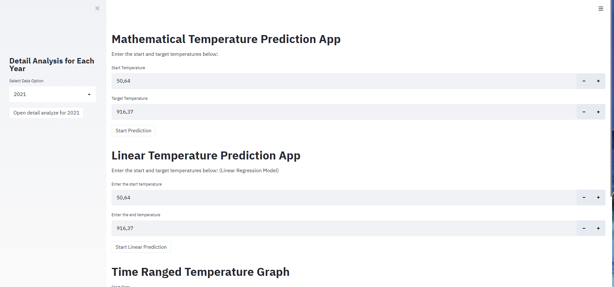
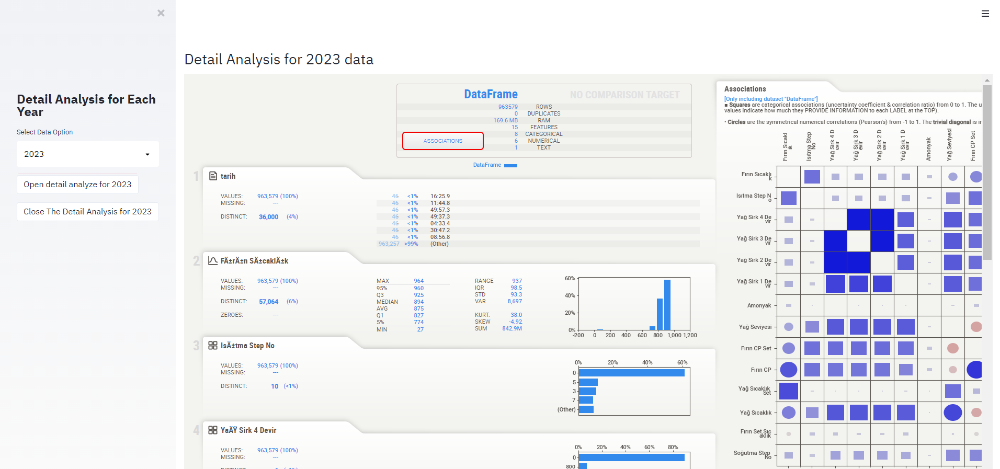
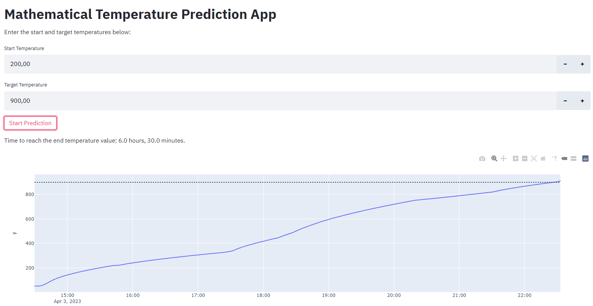
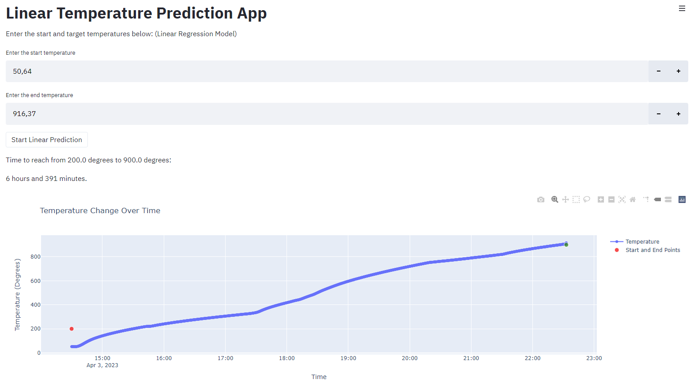
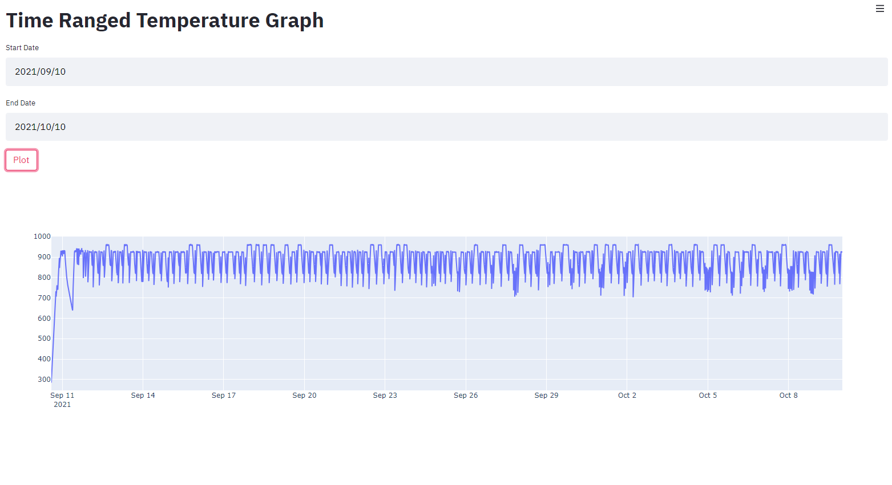

# Time Dependent Temperature Project

## Application Interface



## Detail analysis for each year

The page where you can select the year you want to analyze from the bar on the left side of the application and see the statistical data of the data for that year.



## Mathematical Temperature Prediction

A model that predicts how long it will take to reach the end temperature from the start temperature by mathematically modeling the increase in temperature.



```python
    st.title("Mathematical Temperature Prediction App")
    
    st.write("Enter the start and target temperatures below:")

    # User input for start and end temperatures
    start_temp = st.number_input("Start Temperature", value=df['temperature'].min())
    end_temp = st.number_input("Target Temperature", value=df['temperature'].max())

    if st.button("Start Prediction"):

        # Calculate the time taken to reach the target temperature
        #This process is used to calculate the rate of change of temperature values per second.
        data['temperature_increment'] = data['temperature'].diff() / data['seconds'].diff()
        
        # Plot the data and the trend for visualization 
        time_to_reach_end_temp = (end_temp - start_temp) / df['temperature_increment'].mean()

        hours = time_to_reach_end_temp // 3600
        minutes = (time_to_reach_end_temp % 3600) // 60

        st.write(f'Time to reach the end temperature value: {hours} hours, {minutes} minutes.')

        fig = px.line(df, x=data["date"], y=data['temperature'])
        fig.add_hline(y=end_temp, line_dash="dot")
        st.plotly_chart(fig, use_container_width=True)
```

## Linear Temperature Prediction

A model that predicts how long it will take to reach the end temperature from the start temperature by modeling the increase in temperature with linear regression.



# Take user input for random start and end temperatures
```python

    st.title("Linear Temperature Prediction App")

    st.write("Enter the start and target temperatures below: (Linear Regression Model)")

    data_linear = pd.read_excel("data/data.xlsx", header=None, names=["date", "temperature"])

    start_temp_linear = st.number_input("Enter the start temperature", value=data_linear["temperature"].min())
    end_temp_linear = st.number_input("Enter the end temperature", value=data_linear["temperature"].max())


    if st.button("Start Linear Prediction"):

        # Convert the 'date' column to datetime format
        data_linear['date'] = pd.to_datetime(data_linear['date'])

        # Calculate the time difference between consecutive timestamps in seconds
        data_linear['time_difference'] = data_linear['date'].diff().dt.total_seconds()

        # Remove the first row with NaN time difference
        data_linear = data_linear.dropna()

        # Calculate the time difference between the first and last timestamps to get the total time elapsed
        total_time_elapsed = (data_linear['date'].iloc[-1] - data_linear['date'].iloc[0]).total_seconds()

        # Calculate the temperature difference between the first and last rows to get the total temperature change
        total_temp_change = data_linear['temperature'].iloc[-1] - data_linear['temperature'].iloc[0]

        # Calculate the average temperature change per second
        average_temp_change_per_second = total_temp_change / total_time_elapsed

        # Create features and labels for the machine learning model
        X = data_linear[['temperature', 'time_difference']]
        y_seconds = (data_linear['temperature'] - data_linear['temperature'].iloc[0]) / average_temp_change_per_second
        y_hours = y_seconds / 3600  # Convert seconds to hours
        y_minutes = y_seconds / 60  # Convert seconds to minutes

        # Train a linear regression model to predict time in seconds
        model_seconds = LinearRegression()
        model_seconds.fit(X, y_seconds)

        # Train a linear regression model to predict time in hours
        model_hours = LinearRegression()
        model_hours.fit(X, y_hours)

        # Train a linear regression model to predict time in minutes
        model_minutes = LinearRegression()
        model_minutes.fit(X, y_minutes)

        # Create a dataframe with user input data
        user_data = pd.DataFrame({
            'temperature': [start_temp_linear, end_temp_linear],
            'time_difference': [10, 10]  # Assuming the user wants predictions for 10 seconds time difference
        })

        # Predict the time in seconds, hours, and minutes
        predicted_seconds = model_seconds.predict(user_data)[1] - model_seconds.predict(user_data)[0]
        predicted_hours = model_hours.predict(user_data)[1] - model_hours.predict(user_data)[0]
        predicted_minutes = model_minutes.predict(user_data)[1] - model_minutes.predict(user_data)[0]

        # Display the result
        st.write(f"Time to reach from {start_temp} degrees to {end_temp} degrees:")
        st.write(f"{int(predicted_hours)} hours and {int(predicted_minutes)} minutes.")

        # Plot the temperature change over time
        fig = go.Figure()

        fig.add_trace(go.Scatter(x=data_linear['date'], y=data_linear['temperature'], mode='lines+markers', name='Temperature'))

        fig.update_layout(title='Temperature Change Over Time',
                        xaxis_title='Time',
                        yaxis_title='Temperature (Degrees)',
                        showlegend=True)

        # Add start and end points to the plot
        fig.add_trace(go.Scatter(x=[data_linear['date'].iloc[0], data_linear['date'].iloc[-1]],
                                y=[start_temp_linear, end_temp_linear],
                                mode='markers',
                                marker=dict(size=[10, 10], color=['red', 'green']),
                                name='Start and End Points'))

        # Show the plot
        st.plotly_chart(fig, use_container_width=True)
```
## Time Renged Temperature Graph 

Graph showing the change of temperature over time by selecting certain time intervals.


```python
        # Plot the temperature change over time
        fig = go.Figure()

        fig.add_trace(go.Scatter(x=data_linear['date'], y=data_linear['temperature'], mode='lines+markers', name='Temperature'))

        fig.update_layout(title='Temperature Change Over Time',
                        xaxis_title='Time',
                        yaxis_title='Temperature (Degrees)',
                        showlegend=True)

        # Add start and end points to the plot
        fig.add_trace(go.Scatter(x=[data_linear['date'].iloc[0], data_linear['date'].iloc[-1]],
                                y=[start_temp_linear, end_temp_linear],
                                mode='markers',
                                marker=dict(size=[10, 10], color=['red', 'green']),
                                name='Start and End Points'))

        # Show the plot
        st.plotly_chart(fig, use_container_width=True)
    
    st.title("Time Ranged Temperature Graph")

    start_date = st.date_input("Start Date", value=all_data["tarih"].min())
    end_date = st.date_input("End Date", value=all_data["tarih"].max())


    if st.button("Plot"):

        start_datetime = pd.to_datetime(start_date)
        end_datetime = pd.to_datetime(end_date)
    
        new_data = all_data[(all_data["tarih"]>= start_datetime) & (all_data["tarih"]<= end_datetime)]
        fig2 = go.Figure([go.Scatter(x=new_data['tarih'], y=new_data['Fırın Sıcaklık'])])
        st.plotly_chart(fig2, use_container_width=True)
```
